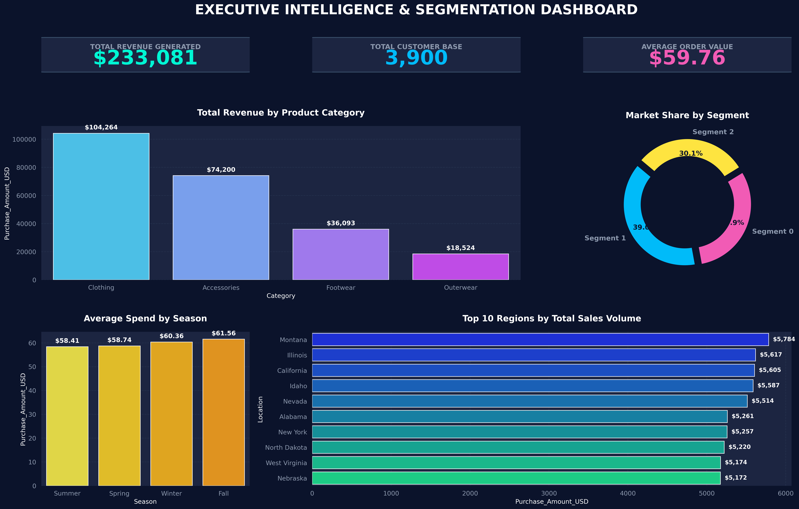

# 🎯 Customer_Segmentation: ML Clustering & Retail Strategy Dashboard


## 📌 Project Overview

**Customer_Segmentation** is an end-to-end analytics project that bridges predictive behavioral modeling with executive-level visualization. This project analyzes 3,900 U.S. retail records to identify which factors—demographics, seasonality, or purchase frequency—most significantly drive customer lifetime value and profitability.

The project is structured into three core components:

1. **Exploratory Data Analysis (SQL & Python):** Querying financial and demographic data to optimize inventory clearance and identify macro-environmental spending trends.
2. **Predictive Segmentation (Machine Learning):** Building a K-Means clustering algorithm to mathematically segment the customer base into three highly distinct, actionable personas (validated via Orange Data Mining workflows).
3. **Executive Visualization (Matplotlib/Seaborn):** Designing a premium, interactive-style dark UI dashboard to communicate these findings and propose targeted marketing campaigns for business decision-making.

## 🛠️ Tech Stack & Tools

* **Languages:** Python (Pandas, NumPy), SQL (MySQL/phpMyAdmin)
* **Machine Learning:** Scikit-Learn (K-Means Clustering, StandardScaler)
* **Data Visualization:** Matplotlib, Seaborn (Custom Midnight UI Theme)
* **Validation & UI:** Orange Data Mining (`.ows` visual workflows)

## 📂 Dataset Information

The dataset consists of 3,900 e-commerce transactions from a U.S.-based retail company. 
* **Key Features:** Customer ID, Age, Item Purchased, Category, Purchase Amount (USD), Location, Season, Previous Purchases.
* **Pre-processing:** Data was queried via SQL, cleaned in Python, and standardized using Z-score normalization (`μ=0, σ²=1`) prior to clustering.

## 🚀 Key Results & Insights

1. **The "Age Fallacy":** Discovered that age has zero statistically significant impact on spending habits, with all age brackets averaging ~$59-$60 per transaction.
2. **Seasonal Spikes:** Identified Fall and Winter as the highest-grossing seasons, driven by colder-climate states like Alaska and Pennsylvania.
3. **Inventory Optimization:** Recommended aggressive discounting on underperforming 'Outerwear' items while protecting the profit margins of high-performing 'Clothing' and 'Accessories'.

### 📊 Executive Dashboard
*(Drop your `dashboard.png` file into your GitHub repo and link it here!)*



## ⚙️ How to Run the Project

1. Clone this repository:
   ```bash
   git clone [https://github.com/yourusername/Customer_Segmentation.git](https://github.com/yourusername/Customer_Segmentation.git)

2. Install the required Python libraries:
   pip install pandas numpy matplotlib seaborn scikit-learn

3. Data Setup: Ensure the project_shopping_trends.csv file is located in the same directory as the Jupyter Notebook. (No database configuration or credentials are required).

4. Open the Jupyter Notebook (Customer_Segmentation.ipynb) to view the Python data pipeline and dashboard rendering.

5. To view the visual ML pipeline, download Orange Data Mining and open the included orange.ows file.
